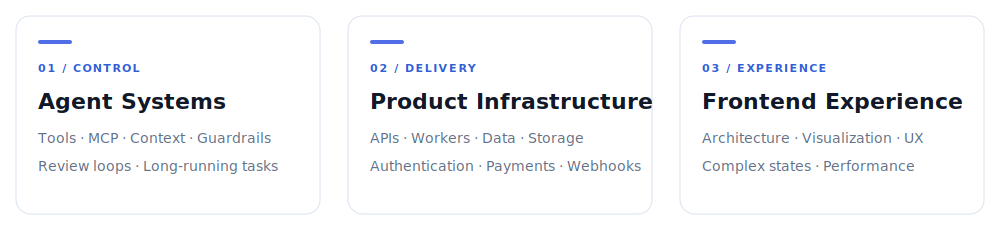
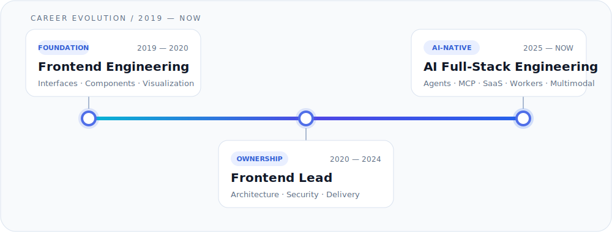

  

  
  

## About Me

- Frontend lead with **7+ years of product engineering experience**, now focused on AI-native full-stack systems.
- Building controllable agent workflows with tool execution, MCP, workflow DAGs, context management, human confirmation, and long-running workers.
- Shipping AI products end to end—from interfaces and API contracts to authentication, payments, storage, webhooks, and async processing.
- Experienced in enterprise frontend architecture, reusable component systems, data visualization, complex interaction, and performance work.
- Using AI as an engineering multiplier while keeping architecture, review, critical decisions, and final verification human-owned.

## Tech Stack

  <picture>
    <source media="(prefers-color-scheme: dark)" srcset="https://skillicons.dev/icons?i=html,css,js,ts,react,nextjs,vue,sass,vite&theme=dark" />
    <source media="(prefers-color-scheme: light)" srcset="https://skillicons.dev/icons?i=html,css,js,ts,react,nextjs,vue,sass,vite&theme=light" />
    
  </picture>

  <picture>
    <source media="(prefers-color-scheme: dark)" srcset="https://skillicons.dev/icons?i=nodejs,python,fastapi,postgres,redis,prisma&theme=dark" />
    <source media="(prefers-color-scheme: light)" srcset="https://skillicons.dev/icons?i=nodejs,python,fastapi,postgres,redis,prisma&theme=light" />
    
  </picture>

  <picture>
    <source media="(prefers-color-scheme: dark)" srcset="https://skillicons.dev/icons?i=cloudflare,docker,git,githubactions,vercel,vscode,linux&theme=dark" />
    <source media="(prefers-color-scheme: light)" srcset="https://skillicons.dev/icons?i=cloudflare,docker,git,githubactions,vercel,vscode,linux&theme=light" />
    
  </picture>

  
  
  
  
  
  

### Full-Stack Details

#### Frontend & Product

- TypeScript, React, Next.js, Vue, Node.js, Sass, Vite
- Component architecture, data visualization, complex interaction, SEO

#### AI Systems

- Agent workflows, MCP, Vercel AI SDK, context management
- Tool calling, human confirmation, workflow DAGs, multimodal pipelines

#### Backend & Data

- FastAPI, PostgreSQL, Redis, ClickHouse, Drizzle, Prisma
- Authentication, payments, webhooks, workers, Cloudflare R2

#### Quality & Media

- Playwright, Vitest, Zod, FFmpeg, OpenCV, PyAV

## Engineering Scope

I work across the complete product path—from controlled agent execution to production infrastructure and the final user experience.

<picture>
  <source media="(max-width: 640px)" srcset="./assets/engineering-scope-mobile.svg" />
  
</picture>

## Career Journey

<picture>
  <source media="(max-width: 640px)" srcset="./assets/career-timeline-mobile.svg" />
  
</picture>

## Contact

  
  

